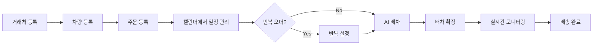

# 🚚 Cold Chain - AI 배차 관리 시스템

> 냉동·냉장 물류 전문 AI 배차 최적화 시스템

[](https://reactjs.org/)
[](https://fastapi.tiangolo.com/)
[](https://www.postgresql.org/)
[](https://www.docker.com/)

---

## 📋 목차

1. [시스템 개요](#-시스템-개요)
2. [주요 기능](#-주요-기능)
3. [기술 스택](#-기술-스택)
4. [빠른 시작](#-빠른-시작)
5. [사용 가이드](#-사용-가이드)
6. [배포](#-배포)
7. [API 문서](#-api-문서)

---

## 🎯 시스템 개요

Cold Chain은 냉동·냉장 물류에 특화된 AI 기반 배차 관리 시스템입니다.

### 핵심 가치
- ⚡ **AI 배차 최적화**: Google OR-Tools 기반 CVRPTW 알고리즘
- 🌡️ **온도대 관리**: 냉동/냉장/겸용/상온 차량 매칭
- 📍 **실시간 GPS 추적**: UVIS 단말기 연동
- 📊 **데이터 기반 의사결정**: 상세한 통계 및 분석
- 📅 **스마트 캘린더**: 드래그 앤 드롭, 반복 오더 자동 생성

---

## ✨ 주요 기능

### 1. 📦 거래처 관리
- **등록 방식**: UI 개별 등록 / 엑셀 일괄 업로드
- **정보 관리**:
  - 거래처 코드, 이름, 구분(상차/하차/양쪽)
  - 주소 (자동 좌표 변환)
  - 상하차 가능 시간
  - **지게차 운전능력** (가능/불가능)
  - 상하차 소요시간 (분)
  - 담당자명, 전화번호
- **엑셀 템플릿**: `clients_template.xlsx` 다운로드 가능
- **페이지**: http://139.150.11.99/clients

---

### 2. 🚗 차량 관리
- **차량 정보**:
  - 차량번호, 차종, 타입(냉동/냉장/겸용/상온)
  - 최대 적재량 (팔레트 수, 중량, 용적)
  - 온도 범위 (최저/최고 온도)
  - 적재함 크기 (길이×폭×높이)
  - 차고지 주소 및 좌표
  - **지게차 운전능력** (가능/불가능)
  - UVIS 단말기 ID (GPS 연동)
- **엑셀 업로드**: `vehicles_template.xlsx`
- **페이지**: http://139.150.11.99/vehicles

---

### 3. 📝 주문 관리
- **등록 방식**:
  - UI 개별 등록
  - 엑셀 일괄 업로드 (`orders_template.xlsx`)
- **주문 정보**:
  - 주문번호, 주문일자
  - 온도대 (냉동/냉장/상온)
  - 상차/하차 거래처 (또는 직접 주소 입력)
  - 팔레트 수량, 용적(CBM)
  - 품목명, 품목코드
  - 상하차 시간 제약
  - 우선순위, 지게차 필요 여부
  - 특수 요구사항
- **주문 상태**: 배차대기 → 배차완료 → 운송중 → 배송완료
- **페이지**: http://139.150.11.99/orders

---

### 4. 📅 오더 캘린더 (NEW!)

#### Phase 1: 기본 캘린더
- **월간/주간/일간 뷰** 전환
- **날짜별 오더 개수** 배지 표시
- **날짜 클릭** → 해당 날짜 오더 목록 팝업
- **상태별 색상 범례**:
  - 🔵 배차대기
  - 🟢 배차완료
  - 🟡 운송중
  - 🔴 배송완료
  - ⚫ 취소

#### Phase 2: 상세 기능
- **드래그 앤 드롭**: 오더를 드래그하여 날짜 변경
- **빠른 오더 등록**: 빈 날짜 클릭 → 주문 등록 페이지 이동
- **시각적 피드백**: 드래그 가능한 이벤트는 `cursor: move`

#### Phase 3: 고급 기능
- **반복 오더 설정**:
  - 매일/매주/매월 자동 생성
  - 종료일 지정 (최대 52개, 약 1년)
  - 예시: "매주 월요일 동일 주문 생성"
- **캘린더에서 바로 배차**:
  - 오더 목록에서 "배차하기" 버튼
  - AI 배차 페이지로 자동 이동 (선택된 주문 포함)
- **예약 오더 자동 확정**:
  - 노란색 "예약" 배지 표시
  - "확정" 버튼으로 정식 오더로 전환
- **오더 배지**:
  - 🟡 예약 (is_reserved)
  - 🟣 반복 (recurring_type)

**페이지**: http://139.150.11.99/calendar

**사용 워크플로우**:
```
빈 날짜 클릭 → 주문 등록 → 캘린더에 표시 
  → (필요 시) 드래그로 날짜 변경 
  → (필요 시) 반복 설정 
  → 예약 오더 확정 
  → 캘린더에서 바로 배차 
  → AI 배차 실행
```

---

### 5. ⚡ AI 배차 최적화

#### 진입 방법
- **방법 A**: 주문 관리 페이지의 **[⚡ AI 배차 (N건)]** 버튼
  - 배차대기 주문 개수 실시간 표시
  - 클릭 시 최적화 페이지로 이동
- **방법 B**: 캘린더에서 오더 선택 → "배차하기" 버튼
- **방법 C**: 직접 접근 - http://139.150.11.99/optimization

#### 배차 프로세스

**Step 1: 주문 선택**
- 배차대기 상태의 주문 목록 확인
- 배차할 주문 선택 (다중 선택 가능)

**Step 2: 알고리즘 선택**

| 알고리즘 | 특징 | 권장 사용 |
|---------|------|----------|
| **Greedy** | • 1-2초 빠른 처리<br>• 거리 기반 최적화<br>• 온도대 매칭<br>• 적재 용량 제약 | 10건 이하 소규모 배차 |
| **CVRPTW** ⭐ | • Google OR-Tools 사용<br>• 30-60초 정밀 처리<br>• 시간 제약 (Time Windows)<br>• 용량 제약 (Capacity)<br>• 온도대 매칭<br>• 거리 최소화<br>• 균등 배분 | **10건 이상 권장**<br>복잡한 제약 조건 |

**Step 3: CVRPTW 설정 (고급 옵션)**
- **시간 제한**: 5-300초 (기본 30초)
- **시간 제약 사용**: ON (픽업/배송 시간 준수)
- **실제 경로 사용**: ON/OFF (Naver API 연동)

**Step 4: AI 배차 최적화 실행**
- POST `/api/v1/dispatches/optimize-cvrptw`
- Request Body:
  ```json
  {
    "order_ids": [1, 2, 3, ...],
    "settings": {
      "time_limit": 30,
      "use_time_windows": true,
      "use_real_routing": false
    }
  }
  ```

**Step 5: AI 계산 과정**
1. **차량 필터링**: 온도대 호환 차량 선택
2. **용량 검증**: 팔레트/중량/용적 확인
3. **경로 최적화**: 최단 경로 계산
4. **시간 제약**: 픽업/배송 시간 준수
5. **균등 배분**: 차량별 작업 부하 균형

**Step 6: 결과 확인**
- 차량별 배정 주문
- 최적화된 경로 순서
- 예상 거리/시간
- 차량 적재율

**Step 7: 배차 확정**
- 결과 검토 후 [배차 확정] 버튼
- 주문 상태: 배차대기 → **배차완료**
- DB 저장: `dispatches`, `dispatch_routes` 테이블

**페이지**: http://139.150.11.99/optimization

---

### 6. 📍 실시간 모니터링
- **GPS 위치 추적**: UVIS 단말기 연동
- **차량 상태**: 시동 ON/OFF, 속도, 온도, 배터리
- **지도 표시**: Leaflet 기반
- **차고지 찾기**: 빠른 검색 및 위치 이동
- **마커 색상 구분**: 시동 상태별
- **WebSocket**: 실시간 업데이트
- **페이지**: http://139.150.11.99/realtime

---

### 7. 📊 배송 완료 처리
- **대시보드**: http://139.150.11.99/dashboard
- **배차 관리**: http://139.150.11.99/dispatches
- **상태 변경**: 배차완료 → 운송중 → 배송완료
- **수동 업데이트**: 필요 시 상태 수동 변경

---

## 🏗️ 기술 스택

### Frontend
- **Framework**: React 18.2 + TypeScript
- **Routing**: React Router DOM 6
- **State Management**: Zustand
- **UI Components**: 
  - Tailwind CSS
  - Lucide React (Icons)
  - React Hot Toast (Notifications)
- **Charts**: Chart.js + react-chartjs-2
- **Maps**: Leaflet + react-leaflet
- **Calendar**: 
  - react-big-calendar
  - react-dnd (Drag and Drop)
  - date-fns (Date manipulation)
- **Build Tool**: Vite
- **Testing**: Jest, Cypress

### Backend
- **Framework**: FastAPI (Python 3.11+)
- **ORM**: SQLAlchemy 2.0
- **Database**: PostgreSQL 14 + PostGIS
- **Migration**: Alembic
- **AI Optimization**: Google OR-Tools (CVRPTW)
- **Routing API**: Naver Maps API
- **GPS Integration**: UVIS API
- **Validation**: Pydantic v2
- **Cache**: Redis 7
- **ASGI Server**: Uvicorn

### Infrastructure
- **Containerization**: Docker + Docker Compose
- **Web Server**: Nginx (Reverse Proxy)
- **Database**: PostgreSQL 14 (PostGIS 3.3)
- **Cache**: Redis 7 (Alpine)

---

## 🚀 빠른 시작

### Prerequisites
- Docker & Docker Compose
- Git

### 개발 환경 실행

```bash
# 1. 저장소 클론
git clone https://github.com/rpaakdi1-spec/3-.git
cd 3-

# 2. 환경 변수 설정
cp .env.example .env
# .env 파일 수정 (DB 비밀번호, API 키 등)

# 3. Docker Compose 실행
docker-compose up -d

# 4. 브라우저 접속
# Frontend: http://localhost:3000
# Backend API: http://localhost:8000
# API Docs: http://localhost:8000/docs
```

### 프로덕션 환경 실행

```bash
# 1. 프로덕션 환경 변수 설정
cp .env.prod.example .env

# 2. Docker Compose (프로덕션)
docker-compose -f docker-compose.prod.yml up -d

# 3. 데이터베이스 마이그레이션
docker-compose -f docker-compose.prod.yml exec backend alembic upgrade head

# 4. 브라우저 접속
# http://YOUR_SERVER_IP
```

---

## 📖 사용 가이드

### 기본 워크플로우



### 1. 거래처 등록
```bash
# URL: http://139.150.11.99/clients

# 개별 등록
1. [+ 거래처 등록] 버튼 클릭
2. 양식 작성:
   - 거래처 코드 *
   - 거래처명 *
   - 구분 * (상차/하차/양쪽)
   - 주소 * (자동 좌표 변환)
   - 상세주소
   - 상하차 가능 시간
   - 지게차 운전능력 (가능/불가능)
   - 상하차 소요시간 (분) * (기본값: 30)
   - 담당자명, 전화번호
   - 특이사항
3. [등록] 클릭

# 엑셀 일괄 등록
1. [양식 다운로드] → clients_template.xlsx
2. 엑셀 작성 (지게차운전능력: Y/N)
3. [엑셀 업로드]
4. 결과 확인
```

### 2. 차량 등록
```bash
# URL: http://139.150.11.99/vehicles

# 개별 등록
1. [+ 차량 등록] 버튼 클릭
2. 양식 작성:
   - 차량번호 *
   - 차종, 타입 * (냉동/냉장/겸용/상온)
   - 최대 팔레트 수 *
   - 최대 중량(kg), 최대 용적(CBM)
   - 적재함 길이(m), 폭(m), 높이(m)
   - 온도 범위 (최저/최고 온도)
   - 지게차 운전능력 * (가능/불가능)
   - 차고지 주소
   - UVIS 단말기 ID (GPS 연동)
   - 운전자명, 전화번호
3. [등록] 클릭

# 엑셀 일괄 등록
1. [양식 다운로드] → vehicles_template.xlsx
2. 엑셀 작성
3. [엑셀 업로드]
```

### 3. 주문 등록 (캘린더 연동)
```bash
# 방법 A: 캘린더에서 빠른 등록
1. http://139.150.11.99/calendar
2. 빈 날짜 클릭
3. "주문 등록 페이지로 이동" 클릭
4. 주문 정보 입력

# 방법 B: 주문 관리 페이지
1. http://139.150.11.99/orders
2. [+ 주문 등록] 클릭
3. 양식 작성
4. 캘린더에서 자동 확인 가능

# 방법 C: 엑셀 일괄 등록
1. [양식 다운로드] → orders_template.xlsx
2. 엑셀 작성 (희망배송일 포함)
3. [엑셀 업로드]
4. 캘린더에서 자동 표시
```

### 4. 캘린더 활용
```bash
# URL: http://139.150.11.99/calendar

# 기본 조작
- 날짜 클릭: 해당 날짜 오더 목록
- 오더 드래그: 날짜 변경
- 뷰 전환: 월간/주간/일간

# 반복 오더 생성
1. 날짜 클릭 → 오더 목록 확인
2. 배차대기 오더에서 [반복 설정] 클릭
3. 반복 주기 선택 (매일/매주/매월)
4. 종료일 선택
5. [반복 주문 생성] 클릭

# 예약 오더 확정
1. 노란색 "예약" 배지가 있는 오더 확인
2. [확정] 버튼 클릭
3. 예약 상태 해제

# 빠른 배차
1. 날짜 클릭 → 오더 목록 확인
2. 배차대기 오더에서 [배차하기] 클릭
3. AI 배차 페이지로 자동 이동
```

### 5. AI 배차 실행
```bash
# URL: http://139.150.11.99/optimization

# 빠른 접근
- 주문 관리 페이지: [⚡ AI 배차 (N건)] 버튼
- 캘린더: 오더 선택 → [배차하기]

# 실행 과정
Step 1: 주문 선택 (다중 선택 가능)
Step 2: 알고리즘 선택
  - Greedy: 10건 이하
  - CVRPTW: 10건 이상 권장
Step 3: 설정 (CVRPTW)
  - 시간 제한: 30초
  - 시간 제약: ON
  - 실제 경로: OFF (빠름) / ON (정확)
Step 4: [AI 배차 최적화] 실행
Step 5: 결과 확인
  - 차량별 배정
  - 경로 순서
  - 예상 거리/시간
Step 6: [배차 확정]
```

### 6. 실시간 모니터링
```bash
# URL: http://139.150.11.99/realtime

# 기능
- 차량 위치 실시간 추적
- 시동/속도/온도/배터리 상태
- 차고지 빠른 찾기
- WebSocket 자동 업데이트
```

---

## 🔧 배포

### 프로덕션 배포 (서버)

```bash
# 1. 서버 접속
ssh root@YOUR_SERVER_IP

# 2. 코드 업데이트
cd /root/uvis
git fetch origin genspark_ai_developer
git reset --hard origin/genspark_ai_developer

# 3. 최신 커밋 확인
git log -1 --oneline

# 4. 데이터베이스 마이그레이션
docker-compose -f docker-compose.prod.yml exec backend alembic upgrade head

# 5. Backend 재시작
docker-compose -f docker-compose.prod.yml restart backend

# 6. Frontend 재빌드
docker-compose -f docker-compose.prod.yml build --no-cache frontend
docker-compose -f docker-compose.prod.yml up -d frontend

# 7. 상태 확인
docker-compose -f docker-compose.prod.yml ps

# 8. 로그 확인 (필요 시)
docker-compose -f docker-compose.prod.yml logs -f backend
docker-compose -f docker-compose.prod.yml logs -f frontend
```

### 데이터베이스 백업

```bash
# 백업
docker-compose -f docker-compose.prod.yml exec db pg_dump -U uvis_user uvis_db > backup_$(date +%Y%m%d).sql

# 복원
docker-compose -f docker-compose.prod.yml exec -T db psql -U uvis_user uvis_db < backup_20260129.sql
```

---

## 📚 API 문서

### Swagger UI
- **URL**: http://139.150.11.99:8000/docs
- **ReDoc**: http://139.150.11.99:8000/redoc

### 주요 API 엔드포인트

#### 거래처 (Clients)
```
GET    /api/v1/clients              # 목록 조회
POST   /api/v1/clients              # 등록
GET    /api/v1/clients/{id}         # 상세 조회
PUT    /api/v1/clients/{id}         # 수정
DELETE /api/v1/clients/{id}         # 삭제
GET    /api/v1/clients/template/download  # 템플릿 다운로드
POST   /api/v1/clients/upload       # 엑셀 업로드
```

#### 차량 (Vehicles)
```
GET    /api/v1/vehicles             # 목록 조회
POST   /api/v1/vehicles             # 등록
GET    /api/v1/vehicles/{id}        # 상세 조회
PUT    /api/v1/vehicles/{id}        # 수정
DELETE /api/v1/vehicles/{id}        # 삭제
POST   /api/v1/vehicles/upload      # 엑셀 업로드
```

#### 주문 (Orders)
```
GET    /api/v1/orders               # 목록 조회
POST   /api/v1/orders               # 등록
GET    /api/v1/orders/{id}          # 상세 조회
PUT    /api/v1/orders/{id}          # 수정
DELETE /api/v1/orders/{id}          # 삭제
POST   /api/v1/orders/upload        # 엑셀 업로드
```

#### 배차 (Dispatches)
```
POST   /api/v1/dispatches/optimize-greedy   # Greedy 배차
POST   /api/v1/dispatches/optimize-cvrptw   # CVRPTW 배차
GET    /api/v1/dispatches                   # 목록 조회
POST   /api/v1/dispatches/confirm           # 배차 확정
```

---

## 📁 프로젝트 구조

```
.
├── backend/
│   ├── app/
│   │   ├── api/              # API 라우터
│   │   ├── models/           # SQLAlchemy 모델
│   │   ├── schemas/          # Pydantic 스키마
│   │   ├── services/         # 비즈니스 로직
│   │   │   ├── ai_optimizer.py        # AI 배차 엔진
│   │   │   ├── excel_template_service.py
│   │   │   └── excel_upload_service.py
│   │   └── utils/            # 유틸리티
│   ├── alembic/              # DB 마이그레이션
│   └── requirements.txt
│
├── frontend/
│   ├── src/
│   │   ├── components/       # React 컴포넌트
│   │   ├── pages/            # 페이지 컴포넌트
│   │   │   ├── OrderCalendarPage.tsx   # 오더 캘린더
│   │   │   ├── OrdersPage.tsx
│   │   │   ├── VehiclesPage.tsx
│   │   │   ├── ClientsPage.tsx
│   │   │   └── ...
│   │   ├── services/         # API 클라이언트
│   │   ├── store/            # Zustand 스토어
│   │   └── utils/            # 유틸리티
│   └── package.json
│
├── docker-compose.yml        # 개발 환경
├── docker-compose.prod.yml   # 프로덕션 환경
├── .env                      # 환경 변수
└── README.md                 # 이 파일
```

---

## 🔐 환경 변수

### Backend (.env)
```env
# Database
POSTGRES_USER=uvis_user
POSTGRES_PASSWORD=uvis_password
POSTGRES_DB=uvis_db

# API Keys
NAVER_CLIENT_ID=your_naver_client_id
NAVER_CLIENT_SECRET=your_naver_client_secret
UVIS_API_KEY=your_uvis_api_key

# Redis
REDIS_URL=redis://redis:6379/0

# JWT
SECRET_KEY=your-secret-key-here
ALGORITHM=HS256
ACCESS_TOKEN_EXPIRE_MINUTES=30
```

### Frontend (.env)
```env
VITE_API_BASE_URL=http://localhost:8000
VITE_WS_URL=ws://localhost:8000
```

---

## 🐛 문제 해결

### 1. Frontend 422 에러
**증상**: `Unprocessable Entity` 에러 발생

**원인**: Order 인터페이스 필드명 불일치

**해결**:
```bash
# 최신 코드로 업데이트
git pull origin genspark_ai_developer

# Frontend 재빌드
docker-compose -f docker-compose.prod.yml build --no-cache frontend
docker-compose -f docker-compose.prod.yml up -d frontend
```

### 2. Alembic 마이그레이션 충돌
**증상**: `Multiple head revisions` 에러

**해결**:
```bash
# 현재 헤드 확인
docker-compose -f docker-compose.prod.yml exec backend alembic heads

# 특정 리비전으로 업그레이드
docker-compose -f docker-compose.prod.yml exec backend alembic upgrade 20260129160000
```

### 3. GPS 데이터 미표시
**증상**: 실시간 모니터링에서 차량 위치 없음

**해결**:
1. UVIS 단말기 ID 확인
2. UVIS_API_KEY 환경 변수 확인
3. Backend 로그 확인:
   ```bash
   docker-compose -f docker-compose.prod.yml logs -f backend | grep UVIS
   ```

---

## 📊 주요 변경 이력

### 2026-01-29
- ✨ **오더 캘린더 추가** (Phase 1-3 완료)
  - Phase 1: 월간/주간/일간 뷰, 날짜별 오더 표시
  - Phase 2: 드래그 앤 드롭, 빠른 등록, 색상 범례
  - Phase 3: 반복 오더, 빠른 배차, 자동 확정
- 🔧 **필드명 수정**: `has_forklift` → `forklift_operator_available`
- 🐛 **버그 수정**: Order 인터페이스 필드명 불일치 해결
- 📝 **거래처 폼 업데이트**: 엑셀 템플릿과 UI 일치

### 2026-01-28
- ⚡ **AI 배차 버튼 개선**: 주문 관리 페이지에 항상 표시
- 🔧 **차량 API 수정**: GPS 데이터 처리 개선
- 📚 **문서 추가**: AI_DISPATCH_GUIDE.md 작성

---

## 🤝 기여

프로젝트 개선을 위한 기여를 환영합니다!

1. Fork the Project
2. Create your Feature Branch (`git checkout -b feature/AmazingFeature`)
3. Commit your Changes (`git commit -m 'Add some AmazingFeature'`)
4. Push to the Branch (`git push origin feature/AmazingFeature`)
5. Open a Pull Request

---

## 📄 라이선스

이 프로젝트는 MIT 라이선스를 따릅니다.

---

## 📞 문의

- **저장소**: https://github.com/rpaakdi1-spec/3-
- **이슈 트래커**: https://github.com/rpaakdi1-spec/3-/issues

---

## 🙏 감사의 말

- [Google OR-Tools](https://developers.google.com/optimization) - AI 배차 최적화
- [FastAPI](https://fastapi.tiangolo.com/) - 고성능 백엔드 프레임워크
- [React](https://reactjs.org/) - 사용자 인터페이스 라이브러리
- [react-big-calendar](https://github.com/jquense/react-big-calendar) - 캘린더 컴포넌트

---

**Made with ❤️ for Cold Chain Logistics**
