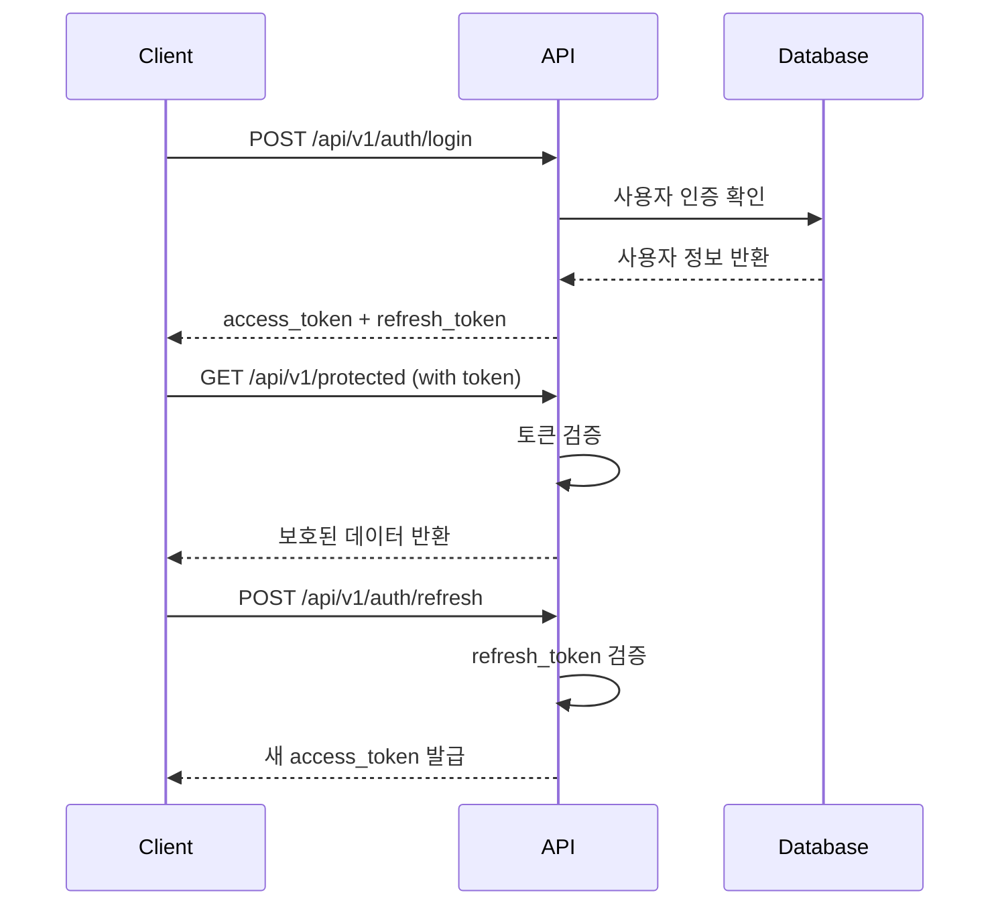

# 🔐 인증 (Authentication)

Cold Chain System API는 **JWT (JSON Web Token)** 기반 인증을 사용합니다.

---

## 🎯 인증 흐름



---

## 📋 인증 엔드포인트

### 1. 회원가입

**Endpoint**: `POST /api/v1/auth/register`

**요청 바디**:
```json
{
  "username": "string",
  "email": "string",
  "password": "string",
  "full_name": "string",
  "role": "dispatcher | driver | admin | viewer"
}
```

**비밀번호 정책**:
- 최소 12자 이상
- 대문자 1개 이상
- 소문자 1개 이상
- 숫자 1개 이상
- 특수문자 1개 이상

**응답 (201)**:
```json
{
  "id": 1,
  "username": "developer123",
  "email": "developer@example.com",
  "full_name": "홍길동",
  "role": "dispatcher",
  "is_active": true,
  "is_2fa_enabled": false,
  "created_at": "2026-01-28T10:00:00Z"
}
```

### 2. 로그인

**Endpoint**: `POST /api/v1/auth/login`

**요청 바디**:
```json
{
  "username": "developer123",
  "password": "SecurePassword123!"
}
```

**응답 (200)**:
```json
{
  "access_token": "eyJhbGciOiJIUzI1NiIsInR5cCI6IkpXVCJ9...",
  "refresh_token": "eyJhbGciOiJIUzI1NiIsInR5cCI6IkpXVCJ9...",
  "token_type": "bearer",
  "expires_in": 3600
}
```

**토큰 정보**:
- `access_token`: API 호출에 사용 (유효기간: 1시간)
- `refresh_token`: 새 액세스 토큰 발급에 사용 (유효기간: 7일)

### 3. 토큰 갱신

**Endpoint**: `POST /api/v1/auth/refresh`

**요청 바디**:
```json
{
  "refresh_token": "eyJhbGciOiJIUzI1NiIsInR5cCI6IkpXVCJ9..."
}
```

**응답 (200)**:
```json
{
  "access_token": "eyJhbGciOiJIUzI1NiIsInR5cCI6IkpXVCJ9...",
  "token_type": "bearer",
  "expires_in": 3600
}
```

### 4. 로그아웃

**Endpoint**: `POST /api/v1/auth/logout`

**헤더**:
```
Authorization: Bearer {access_token}
```

**응답 (200)**:
```json
{
  "message": "Successfully logged out"
}
```

!!! info "토큰 무효화"
    로그아웃 시 서버는 토큰을 블랙리스트에 추가하여 더 이상 사용할 수 없게 만듭니다.

### 5. 현재 사용자 정보

**Endpoint**: `GET /api/v1/auth/me`

**헤더**:
```
Authorization: Bearer {access_token}
```

**응답 (200)**:
```json
{
  "id": 1,
  "username": "developer123",
  "email": "developer@example.com",
  "full_name": "홍길동",
  "role": "dispatcher",
  "is_active": true,
  "is_2fa_enabled": false,
  "last_login": "2026-01-28T10:00:00Z",
  "created_at": "2026-01-28T09:00:00Z"
}
```

---

## 🔒 Two-Factor Authentication (2FA)

### 2FA 활성화

**Endpoint**: `POST /api/v1/security/2fa/enable`

**응답 (200)**:
```json
{
  "secret": "JBSWY3DPEHPK3PXP",
  "qr_code_url": "/api/v1/security/2fa/qrcode",
  "backup_codes": [
    "ABC123DEF456",
    "XYZ789GHI012"
  ]
}
```

**사용 방법**:
1. Google Authenticator 또는 Authy 앱 설치
2. QR 코드 스캔 또는 Secret Key 수동 입력
3. 앱에서 생성된 6자리 코드로 검증

### 2FA 검증

**Endpoint**: `POST /api/v1/security/2fa/verify`

**요청 바디**:
```json
{
  "token": "123456"
}
```

**응답 (200)**:
```json
{
  "verified": true,
  "message": "2FA successfully enabled"
}
```

### 2FA 로그인

2FA가 활성화된 경우, 로그인 후 추가 단계가 필요합니다:

1. 일반 로그인 (`POST /api/v1/auth/login`)
2. 임시 토큰 받기
3. 2FA 코드 제출 (`POST /api/v1/auth/2fa-login`)
4. 최종 액세스 토큰 받기

**2FA 로그인 요청**:
```json
{
  "temp_token": "temp_eyJhbGciOiJIUzI1NiIsInR5cCI6IkpXVCJ9...",
  "totp_code": "123456"
}
```

---

## 🛡️ 보안 Best Practices

### 1. 토큰 저장

❌ **하지 말아야 할 것**:
- 로컬 스토리지에 저장 (XSS 공격 위험)
- URL 파라미터에 포함
- 로그에 기록

✅ **권장 방법**:
- HttpOnly 쿠키 (웹 앱)
- 보안 저장소 (모바일 앱: Keychain/Keystore)
- 메모리 변수 (단기 사용)

### 2. HTTPS 사용

프로덕션 환경에서는 **항상 HTTPS**를 사용하세요:

```
✅ https://api.coldchain.com
❌ http://api.coldchain.com
```

### 3. 토큰 만료 처리

```python
import requests

def api_call_with_refresh(url, token, refresh_token):
    headers = {"Authorization": f"Bearer {token}"}
    response = requests.get(url, headers=headers)
    
    if response.status_code == 401:  # Token expired
        # Refresh token
        refresh_response = requests.post(
            "https://api.coldchain.com/api/v1/auth/refresh",
            json={"refresh_token": refresh_token}
        )
        
        if refresh_response.status_code == 200:
            new_token = refresh_response.json()["access_token"]
            headers["Authorization"] = f"Bearer {new_token}"
            response = requests.get(url, headers=headers)
    
    return response
```

### 4. Rate Limiting

로그인 엔드포인트는 엄격한 Rate Limit이 적용됩니다:

- **로그인**: 5 requests/minute
- **일반 API**: 100 requests/minute

---

## ⚠️ 오류 처리

### 401 Unauthorized

토큰이 없거나 유효하지 않을 때:

```json
{
  "detail": "Not authenticated"
}
```

**해결 방법**: 로그인하여 새 토큰을 발급받으세요.

### 403 Forbidden

권한이 부족할 때:

```json
{
  "detail": "Insufficient permissions"
}
```

**해결 방법**: 해당 API를 호출할 권한이 있는 계정으로 로그인하세요.

### 429 Too Many Requests

Rate Limit을 초과했을 때:

```json
{
  "detail": "Rate limit exceeded. Try again in 60 seconds."
}
```

**해결 방법**: 잠시 대기 후 재시도하세요.

---

## 📚 관련 문서

- [시작하기](getting-started.md)
- [보안 API 레퍼런스](api-reference/security.md)
- [오류 처리](error-handling.md)
